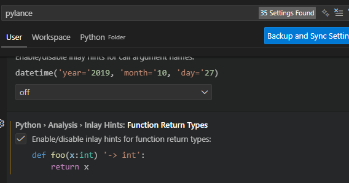

Python

## Installation

1) Install VS code
2) Goto extensions and install python plugin
3) Goto extension and install code runner
4) goto setting -> setting -> run in terminal -> click whether to run in terminal
5) GOTO extension jupyter, pylance

## DAY 1
1) Create a python class and run
2) User Input using input()
3) Variables
4) lenght of a string using len()

## Day 2
1) Data Types
2) String
3) Float
4) Integer
5) Boolean
6) Type Error, Type Checking and COnversion
7) Mathematical operators +,-,*,/,//,**
8) round
9) f-string

## Day 3
1) Control Flow if: else:
2) Modulo Operator %
3) Nested If else, elif
4) Multiple if condition
5) Logical Operators (and, or, not)

## Day 4
1) Random Module
2) create my module using import
3) Random int, random float, uniform
4) List, index errors, nested lists

## Day 5
1) Loops
2) Highest Score questions
3) for loops and range()
4) while loops

## Day 6
1) Functions
2) Indentattion - use 4 spaces

## Day 8
1) function with inputs
2) Positional vs keyword arguments

## Day 9
1) Python Dictionary
2) Nesting Lists

## Day 10
1) function with output
2) Docstrings

## Day 12
1) Local vs global Scope
2) Constants

## Day 16
1) Object oriented programming OOP
2) packages

