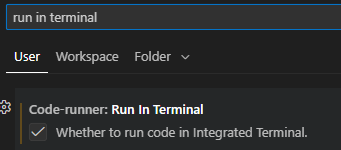

Python

## Installation

1) Install VS code
2) Goto extensions and install python plugin
3) Goto extension and install code runner
4) goto setting -> setting -> run in terminal -> click whether to run in terminal

## DAY 1
1) Create a python class and run
2) User Input using input()
3) Variables
4) lenght of a string using len()

## Day 2
1) Data Types
2) String
3) Float
4) Integer
5) Boolean
6) Type Error, Type Checking and COnversion
7) Mathematical operators +,-,*,/,//,**
8) round
9) f-string

## Day 3
1) Control Flow if: else:
2) Modulo Operator %
3) Nested If else, elif
4) Multiple if condition
5) Logical Operators (and, or, not)